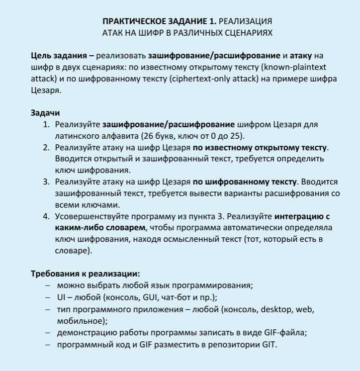

# Практическое задание №1

- Оригинальное описание задания

# 1.Введение 
- Целью работы является разработка программного средства, которое реализует классический шифр Цезаря для латинского алфавита и демонстрирует две основные криптоаналитические атаки: по известному открытому тексту (known-plaintext attack) и по шифрованному тексту (ciphertext-only attack). В расширенной версии программа автоматически определяет ключ шифрования, используя словарь для поиска осмысленного текста.
## 1.1.Задачи проекта:
1. Реализовать функции зашифрования и расшифрования шифром Цезаря (ключ от 0 до 25, алфавит – 26 строчных/прописных латинских букв).
2. Реализовать атаку по известному открытому тексту: по введённым открытому и шифрованному текстам программа вычисляет ключ.
3. Реализовать атаку по шифрованному тексту: программа выводит все 26 вариантов расшифрования.
4. Усовершенствовать программу для автоматического определения ключа с использованием внешнего словаря (файла со списком английских слов).
## 1.2.Выбранные технологии:
- Язык программирования - Python 3.11
- Интерфейс - консольное меню
- Работа со словарём - чтение текстофого файла **worlds.txt**
- Демонстрация - GIF-анимация, записанная утилитой **terminalizer**
- Репозиторий - в моём гите **https://github.com/DmitriyKunitsin**
# 2.Теоретическая часть
## 2.1 Шифр Цезаря
**Шифр Цезаря** – моноалфавитный шифр подстановки, в котором каждая буква открытого текста заменяется буквой, смещённой на фиксированное число позиций k в алфавите. Для латинского алфавита из 26 букв:
* Зашифрование: 
**C = (P + k) mod 26**, где P – позиция буквы (A=0, B=1, …), **C** – позиция зашифрованной буквы.
* Расшифрование:
**P = (C - k) mod 26.**
Ключ k может принимать значения от 0 до 25. Программа должна корректно обрабатывать как строчные, так и прописные буквы, не изменяя остальные символы.
## 2.2. Атака по известному открытому тексту
Зная пару (открытый текст, шифротекст), можно вычислить ключ как разность позиций соответствующих букв. Выбирается первая буква, присутствующая в обоих текстах, и по ней определяется ключ:
k = (C_pos - P_pos) mod 26.
Для надёжности можно проверить ключ на нескольких буквах.
## 2.3. Атака по шифрованному тексту
Самый простой метод – полный перебор всех 26 ключей. Пользователь получает список расшифровок и визуально находит осмысленный текст. Автоматизация этого процесса возможна путём проверки расшифрованного текста на наличие слов из словаря.