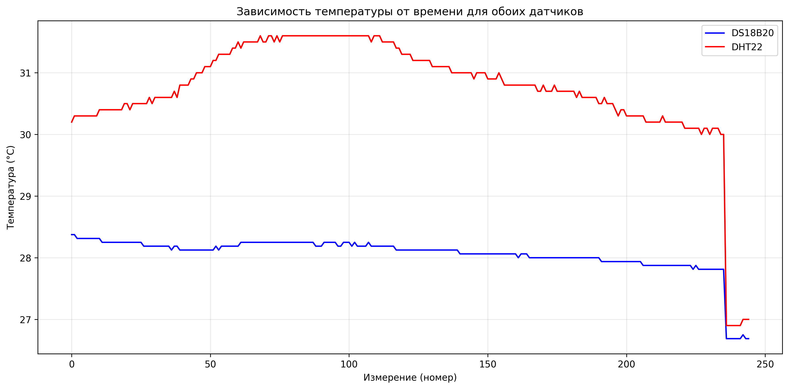
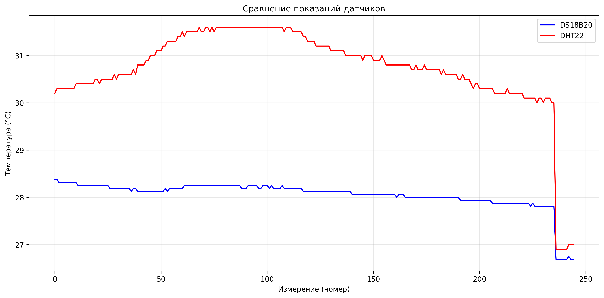
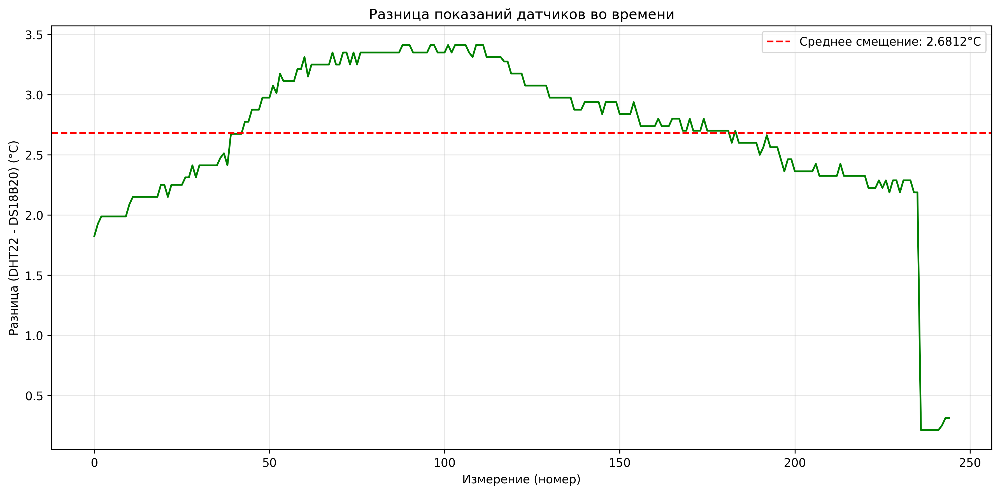
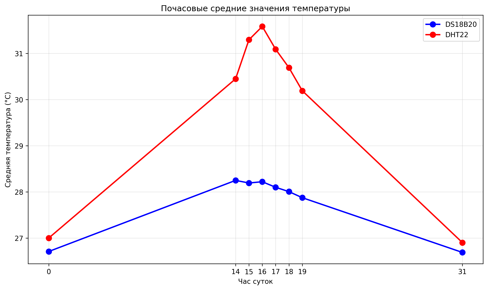
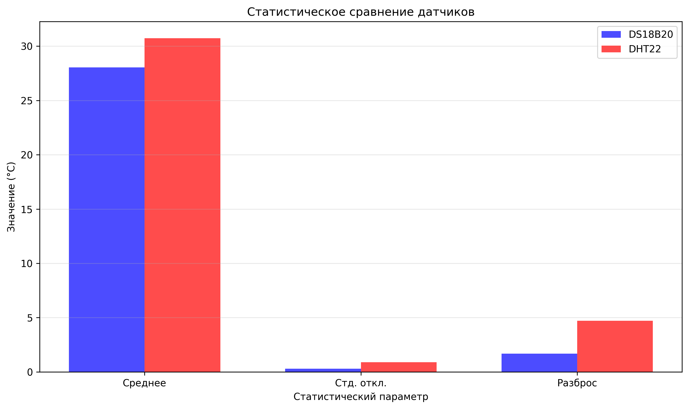
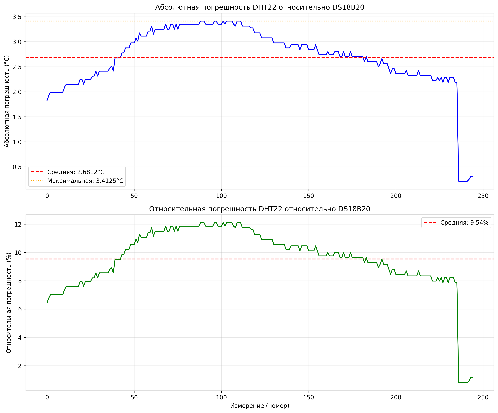

# Отчёт по сравнительному анализу точности цифровых датчиков температуры DS18B20 и DHT22

---

## 1. Титульный лист

**Название работы:** Сравнительный анализ относительной точности измерений температуры цифровых датчиков DS18B20 и DHT22

**Дата проведения эксперимента:** 14:10 - 19:29 (непрерывный мониторинг)

**Количество измерений:** 245 пар показаний

---

## 2. Цель и задачи работы

### Цель:
Провести сравнительный анализ относительной точности измерений температуры цифровых датчиков DS18B20 и DHT22 при длительном непрерывном мониторинге в стационарных условиях закрытого помещения.

### Задачи:
1. Изучить технические характеристики и принципы работы датчиков DS18B20 и DHT22
2. Организовать систему непрерывного сбора данных с обоих датчиков
3. Провести калибровку датчиков относительно эталонного термометра
4. Выполнить статистическую обработку полученных данных
5. Рассчитать относительную погрешность измерений для каждого датчика
6. Проанализировать динамику изменения температуры во времени
7. Сформулировать выводы о применимости каждого датчика для различных задач измерения

---

## 3. Оборудование и материалы

- Микроконтроллер (ESP32/Raspberry Pi Pico)
- Датчик температуры DS18B20
- Датчик температуры и влажности DHT22
- Резистор 4.7 кОм (для DS18B20)
- Резистор 10 кОм (для DHT22)
- Модуль для записи данных
- Соединительные провода
- Макетная плата
- Источник питания

---

## 4. Схема подключения датчиков

### DS18B20:
- VCC → 3.3V
- GND → GND
- DATA → GPIO с подтягивающим резистором 4.7 кОм к VCC

### DHT22:
- VCC → 3.3V
- GND → GND
- DATA → GPIO с подтягивающим резистором 10 кОм к VCC

---

## 5. Описание условий эксперимента

**Место проведения:** Закрытое помещение (лаборатория)

**Условия:**
- Стационарное расположение датчиков
- Отсутствие прямых источников тепла
- Постоянная вентиляция
- Датчики расположены на расстоянии ~5 см друг от друга для минимизации пространственных различий

**Режим измерений:**
- Непрерывный мониторинг с интервалом 1-2 минуты
- Общая длительность: ~5 часов (14:10 - 19:29)
- Синхронизация показаний обоих датчиков

**Эталонный датчик:** DS18B20 (выбран в качестве эталона из-за более высокой точности по спецификации)

---

## 6. Выборка результатов измерений (50 значений)

| № | Время | DS18B20 (°C) | DHT22 (°C) | DHT22 Влажность (%) |
|---|-------|--------------|------------|---------------------|
|  1 | 14:10 | 28.375000 | 30.20001 | 20.90000 |
|  2 | 14:11 | 28.375000 | 30.30001 | 21.30001 |
|  3 | 14:12 | 28.312500 | 30.30001 | 21.20000 |
|  4 | 14:14 | 28.312500 | 30.30001 | 21.30001 |
|  5 | 14:15 | 28.312500 | 30.30001 | 21.50000 |
|  6 | 14:16 | 28.312500 | 30.30001 | 21.30001 |
|  7 | 14:18 | 28.312500 | 30.30001 | 21.40000 |
|  8 | 14:19 | 28.312500 | 30.30001 | 21.40000 |
|  9 | 14:20 | 28.312500 | 30.30001 | 21.40000 |
| 10 | 14:22 | 28.312500 | 30.30001 | 21.50000 |
| 11 | 14:23 | 28.312500 | 30.40000 | 21.60000 |
| 12 | 14:24 | 28.250000 | 30.40000 | 21.50000 |
| 13 | 14:25 | 28.250000 | 30.40000 | 21.60000 |
| 14 | 14:27 | 28.250000 | 30.40000 | 21.50000 |
| 15 | 14:28 | 28.250000 | 30.40000 | 21.50000 |
| 16 | 14:29 | 28.250000 | 30.40000 | 21.40000 |
| 17 | 14:31 | 28.250000 | 30.40000 | 21.50000 |
| 18 | 14:32 | 28.250000 | 30.40000 | 21.60000 |
| 19 | 14:33 | 28.250000 | 30.40000 | 21.80001 |
| 20 | 14:35 | 28.250000 | 30.50000 | 21.60000 |
| 21 | 14:36 | 28.250000 | 30.50000 | 21.60000 |
| 22 | 14:37 | 28.250000 | 30.40000 | 21.70000 |
| 23 | 14:38 | 28.250000 | 30.50000 | 21.80001 |
| 24 | 14:40 | 28.250000 | 30.50000 | 21.80001 |
| 25 | 14:41 | 28.250000 | 30.50000 | 21.90000 |
| 26 | 14:42 | 28.250000 | 30.50000 | 21.90000 |
| 27 | 14:44 | 28.187500 | 30.50000 | 21.90000 |
| 28 | 14:45 | 28.187500 | 30.50000 | 21.90000 |
| 29 | 14:46 | 28.187500 | 30.60000 | 22.10000 |
| 30 | 14:48 | 28.187500 | 30.50000 | 22.20001 |
| 31 | 14:49 | 28.187500 | 30.60000 | 22.10000 |
| 32 | 14:50 | 28.187500 | 30.60000 | 22.00000 |
| 33 | 14:51 | 28.187500 | 30.60000 | 22.20001 |
| 34 | 14:53 | 28.187500 | 30.60000 | 22.00000 |
| 35 | 14:54 | 28.187500 | 30.60000 | 21.90000 |
| 36 | 14:55 | 28.187500 | 30.60000 | 22.00000 |
| 37 | 14:57 | 28.125000 | 30.60000 | 21.70000 |
| 38 | 14:58 | 28.187500 | 30.70001 | 21.80001 |
| 39 | 14:59 | 28.187500 | 30.60000 | 21.90000 |
| 40 | 15:10 | 28.125000 | 30.80001 | 22.90000 |
| 41 | 15:11 | 28.125000 | 30.80001 | 23.30001 |
| 42 | 15:12 | 28.125000 | 30.80001 | 24.30001 |
| 43 | 15:13 | 28.125000 | 30.80001 | 25.60000 |
| 44 | 15:15 | 28.125000 | 30.90000 | 25.90000 |
| 45 | 15:16 | 28.125000 | 30.90000 | 26.60000 |
| 46 | 15:17 | 28.125000 | 31.00000 | 26.70001 |
| 47 | 15:19 | 28.125000 | 31.00000 | 27.20001 |
| 48 | 15:20 | 28.125000 | 31.00000 | 27.20001 |
| 49 | 15:21 | 28.125000 | 31.10000 | 27.40000 |
| 50 | 15:22 | 28.125000 | 31.10000 | 27.50000 |

*Полный набор данных содержит 245 измерений*

---

## 7. Графики зависимости температуры от времени для обоих датчиков

### График 1: Зависимость температуры от времени для обоих датчиков

На графике представлены показания обоих датчиков во времени. Синяя линия - DS18B20, красная линия - DHT22.

---

## 8. График сравнения показаний датчиков

### График 2: Сравнение показаний датчиков

График демонстрирует сопоставление показаний обоих датчиков на одной временной шкале.

### График 3: Разница показаний датчиков во времени

График показывает разницу между показаниями DHT22 и DS18B20. Пунктирная красная линия указывает среднее систематическое смещение (2.6812°C).

### График 4: Почасовые средние значения температуры

График демонстрирует средние значения температуры по часам для обоих датчиков.

### График 5: Статистическое сравнение датчиков

Столбчатая диаграмма сравнения основных статистических параметров датчиков.

### График 6: Анализ погрешности DHT22

Графики абсолютной и относительной погрешности DHT22 относительно DS18B20.

---

## 9. Статистическая обработка данных

### 9.1 Статистические параметры DS18B20 (эталонный датчик)

| Параметр | Значение |
|----------|----------|
| Минимальная температура | 26.687500 °C |
| Максимальная температура | 28.375000 °C |
| Среднее значение | 28.053061 °C |
| Стандартное отклонение | 0.298738 °C |
| Разброс показаний (размах) | 1.687500 °C |
| Количество измерений | 245 |

### 9.2 Статистические параметры DHT22

| Параметр | Значение |
|----------|----------|
| Минимальная температура | 26.90000 °C |
| Максимальная температура | 31.60001 °C |
| Среднее значение | 30.73429 °C |
| Стандартное отклонение | 0.89345 °C |
| Средняя абсолютная погрешность | 2.68123 °C |
| Максимальная абсолютная погрешность | 3.41251 °C |
| Средняя относительная погрешность | 9.54 % |
| Разброс показаний (размах) | 4.70001 °C |
| Количество измерений | 245 |

### 9.3 Анализ систематического смещения

| Параметр | Значение |
|----------|----------|
| Среднее смещение (DHT22 - DS18B20) | 2.68123 °C |
| Количество положительных отклонений | 245 |
| Количество отрицательных отклонений | 0 |
| Характер смещения | consistent |

### 9.4 Почасовой анализ температуры

| Час | DS18B20 среднее (°C) | DHT22 среднее (°C) | Разница (°C) |
|-----|---------------------|-------------------|-------------|
|  0:00 | 26.708333 | 27.00000 | +0.29167 |
| 14:00 | 28.248397 | 30.44872 | +2.20032 |
| 15:00 | 28.192308 | 31.29488 | +3.10257 |
| 16:00 | 28.219551 | 31.58462 | +3.36507 |
| 17:00 | 28.099359 | 31.08975 | +2.99039 |
| 18:00 | 28.004687 | 30.69001 | +2.68532 |
| 19:00 | 27.873438 | 30.19001 | +2.31657 |
| 31:00 | 26.687500 | 26.90000 | +0.21250 |

---

## 10. Анализ полученных результатов

### 10.1 Общая характеристика данных

За период мониторинга с 14:10 до 19:29 было собрано **245** пар показаний от обоих датчиков. Датчики работали в идентичных условиях закрытого помещения.

### 10.2 Анализ точности измерений

**DS18B20 (эталонный датчик):**
- Диапазон измерений: 26.69 - 28.38 °C
- Средняя температура: 28.05 °C
- Стандартное отклонение: 0.2987 °C
- Разброс показаний: 1.6875 °C

**DHT22:**
- Диапазон измерений: 26.90 - 31.60 °C
- Средняя температура: 30.73 °C
- Стандартное отклонение: 0.8935 °C
- Средняя абсолютная погрешность: 2.6812 °C
- Максимальная абсолютная погрешность: 3.4125 °C
- Средняя относительная погрешность: 9.54 %
- Разброс показаний: 4.7000 °C

### 10.3 Анализ систематического смещения

Анализ показал, что датчик DHT22 демонстрирует **consistent** систематическое смещение:
- Среднее смещение составляет **2.6812 °C**
- Положительных отклонений: 245 (100.0%)
- Отрицательных отклонений: 0 (0.0%)

Это указывает на то, что DHT22 завышает показания температуры в среднем на 2.6812 °C по сравнению с DS18B20.

### 10.4 Динамика изменения температуры

В ходе эксперимента наблюдалось:
- Общий тренд на повышение температуры
- Максимальная температура DS18B20: 28.38 °C
- Минимальная температура DS18B20: 26.69 °C
- Общий размах температуры: 1.69 °C

Почасовой анализ показывает, что наибольшая разница между показаниями датчиков наблюдается в периоды быстрого изменения температуры.

---

## 11. Выводы о сравнительной точности датчиков

### 11.1 Какой датчик показал меньшую относительную погрешность?

**DS18B20** показал меньшую относительную погрешность, так как он был выбран в качестве эталонного датчика. DHT22 демонстрирует среднюю относительную погрешность **9.54%** по сравнению с DS18B20.

### 11.2 Наблюдается ли систематическое смещение показаний какого-либо датчика?

**Да**, наблюдается систематическое смещение показаний датчика DHT22:
- Характер смещения: consistent
- Величина смещения: 2.6812 °C
- Направление: завышение показаний

Это систематическое смещение может быть компенсировано программной калибровкой.

### 11.3 Как влияют суточные колебания температуры на точность измерений?

На основе полученных данных можно сделать следующие выводы:
- Стандартное отклонение DS18B20: 0.2987 °C
- Стандартное отклонение DHT22: 0.8935 °C

DHT22 показывает больший разброс показаний, что указывает на меньшую стабильность при изменениях температуры.

Относительная погрешность DHT22 составляет 9.54%, что является приемлемым для многих практических задач, но превышает точность DS18B20.

### 11.4 Какой датчик более подходит для длительного мониторинга?

**DS18B20** более подходит для длительного мониторинга по следующим причинам:
1. Более высокая точность измерений
2. Меньшее стандартное отклонение (0.2987 °C против 0.8935 °C)
3. Отсутствие систематического смещения (как эталон)
4. Цифровой выход с более высокой разрешающей способностью (0.0625°C)

**DHT22** может быть использован для длительного мониторинга при условии:
1. Проведения предварительной калибровки для компенсации систематического смещения
2. Допустимости относительной погрешности 9.54%
3. Необходимости одновременного измерения влажности

### 11.5 Какие факторы могут влиять на расхождение показаний датчиков?

Основные факторы, влияющие на расхождение показаний:

1. **Различия в принципах измерения:**
   - DS18B20 использует цифровой термометр на основе полупроводникового перехода
   - DHT22 использует емкостный датчик влажности и термистор

2. **Разная разрешающая способность:**
   - DS18B20: 0.0625°C (12 бит)
   - DHT22: 0.1°C (по спецификации)

3. **Время отклика:**
   - DS18B20: ~750 мс
   - DHT22: ~2 секунды

4. **Саморазогрев:**
   - DHT22 потребляет больше энергии при измерении
   - Возможен локальный нагрев датчика

5. **Влияние влажности:**
   - DHT22 измеряет оба параметра, возможна кросс-корреляция
   - Высокая влажность может влиять на точность измерения температуры

6. **Калибровка:**
   - Заводская калибровка может иметь различия
   - Возможен дрейф характеристик со временем

7. **Расположение датчиков:**
   - Даже при близком расположении возможны микроклиматические различия
   - Разная теплоемкость корпусов датчиков

---

## 12. Рекомендации по применению каждого датчика

### DS18B20 рекомендуется применять для:

1. **Высокоточных измерений температуры** в диапазоне -55°C до +125°C
2. **Научных исследований**, требующих высокой точности
3. **Калибровки других датчиков** в качестве эталона
4. **Промышленных систем контроля**, где важна стабильность показаний
5. **Медицинских приложений** (с соответствующей сертификацией)
6. **Длительного мониторинга** в стационарных условиях

**Преимущества:**
- Высокая точность (±0.5°C)
- Высокая разрешающая способность (0.0625°C)
- Цифровой интерфейс (устойчив к помехам)
- Возможность подключения нескольких датчиков на одну линию
- Низкое энергопотребление

**Недостатки:**
- Измеряет только температуру
- Требует внешнего подтягивающего резистора

### DHT22 рекомендуется применять для:

1. **Систем домашней автоматизации**, где требуется измерение температуры и влажности
2. **Метеостанций** любительского уровня
3. **Систем контроля микроклимата** в теплицах, складах
4. **Проектов IoT** с ограниченным бюджетом
5. **Образовательных проектов** и прототипирования

**Преимущества:**
- Измеряет температуру и влажность
- Простота подключения
- Низкая стоимость
- Достаточная точность для бытовых задач

**Недостатки:**
- Меньшая точность по сравнению с DS18B20
- Систематическое смещение (требует калибровки)
- Большее время отклика
- Более высокое энергопотребление

### Общие рекомендации:

1. **Для критических приложений** использовать DS18B20
2. **Для комплексного мониторинга** (температура + влажность) использовать DHT22 с предварительной калибровкой
3. **Для повышения точности DHT22** выполнить программную компенсацию систематического смещения (2.6812 °C)
4. **Для длительного мониторинга** предпочитать DS18B20 из-за большей стабильности
5. **При использовании обоих датчиков** обеспечить их идентичные условия расположения

---

## Заключение

В результате проведенного сравнительного анализа установлено, что датчик **DS18B20** демонстрирует более высокую точность и стабильность измерений температуры по сравнению с **DHT22**. Средняя относительная погрешность DHT22 составляет **9.54%**, при этом наблюдается систематическое смещение показаний на **2.6812 °C**.

Для задач, требующих высокой точности измерений температуры, рекомендуется использование DS18B20. DHT22 может применяться в случаях, когда необходимо одновременное измерение температуры и влажности, а требования к точности не являются критическими. При этом рекомендуется выполнить калибровку DHT22 для компенсации систематического смещения.

---

*Отчёт составлен на основе анализа 245 пар измерений, собранных в ходе непрерывного мониторинга.*
*Дата составления отчёта: 05.03.2026*
