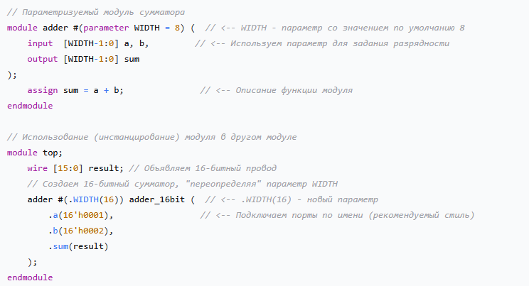
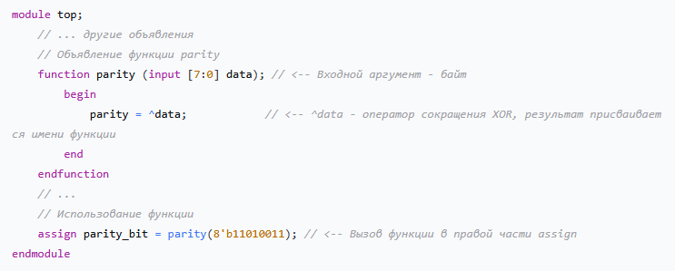
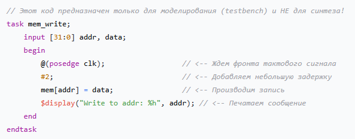

# Аргументы и размышления в пользу использования FPGA

# Почему FPGA, а не MCU
| Характеристика | MCU (STM32) | FPGA (Zynq-7000 и др.) |
| :--- | :--- | :--- |
| **Архитектура** | Последовательный исполнитель (ядро). Даже несколько ядер — это конечное число последовательных потоков. | Пространственный исполнитель. Тысячи независимых логических элементов. |
| **Выполнение кода** | Программа из инструкций (чтение → обработка → запись). Одна инструкция за такт (или несколько тактов). | Проектирование аппаратной схемы. Все блоки работают параллельно. |
| **Обработка потока данных** | На частотах >50–100 МГц "захлёбывается": не успевает обработать каждый отсчёт. | Гарантированно обрабатывает каждый отсчёт, даже на 500 МГц, за счёт конвейеризации и пространственного параллелизма. |
| **Задержка (latency)** | Высокая и недетерминированная (зависит от прерываний, кэша). | Низкая и фиксированная (известна на этапе синтеза). |
| **Параллелизм** | Временной — один исполнитель делает много операций последовательно. | Пространственный — много простых исполнителей работают одновременно. |

- **Главный вывод для задачи :** MCU не сможет обрабатывать поток отсчётов с частотой 500 МГц (новое значение каждые 2 нс), даже если сам АЦП выдаёт данные на этой частоте. FPGA — сможет, потому что вы создаёте аппаратный конвейер, где каждый этап выполняется отдельной схемой.

# Основные понятия 
## FPGA / ПЛИС
* **ПЛИС** - Программируемая логическая интегральная схема
* **FPGA** - **Программируемая пользователем вентильная матрица** (field-programmable gate array)
* **Внутри** - тысячи **LUT** (look-up tables), триггеры, блоки памяти (**BRAM**), DSP-слайсы.
* **LUT** - базовый элемент , реализующий любую логическую функцию от 4-6 входов. Колличество **LUT** определяет **сложность** логики.

## Максимальная тактовая частота (Fmax)
* Зависит от **технологического процесса** и **архитектуры** кристалла.
* Не зависит прямо от колличества **LUT**.
* Для 500 МГц нужны современные FPGA (Zynq-7000, Artix-7, Kintex-7, Lattice ECP5, PolarFire). Старые Spartan-6 или Cyclone IV выше 200–250 МГц не поднимутся.

## Синтез 
* Процесс, превращающий код **Verilog** в **принципиальную электрическую схему** (логические вентили , триггеры, соединения).
* Аналог компиляции , но результат - не машинный код, а "чертёж" схемы.

## Комбинаторная логика 
* Логика **без памяти**. Выход зависит только от текущих входов.
* Пример : **assign sum = a + b;** - это комбинаторная схема.
* В Verilog описываются через **assign** или **always @(*)**

## Регистры (триггеры)
* Хранят состояние между тактами
* В Verilog: **always @(posedge clk) с <=**

## Конвейер (Pipeline)
* Разбиение сложной операции на несколько простых ступеней.
* **Пропускная способность** - 1 результат  на такт.
* **Задержка(latency)** - колличество тактов от входа до выхода (например, 3 такта)
* Идеально для потоковой обработки

## Конечный автомат (FSM)
* Последовательный подход : набо состояний, переходы между ними.
* На каждый переход - один или несколько тактов.
* Хорошо для управления, но не для высокоскоростной обработки данных.


## Полезные ссылки
1. [Документация на Zynq7000](https://docs.amd.com/r/en-US/ug585-zynq-7000-SoC-TRM?tocId=Hf6C7Oo5ABvv2hkWRoiihQ)
2. [Детально о логических блоках (LUT, триггеры, сдвиговые регистры)](https://docs.amd.com/r/en-US/ug474_7Series_CLB/About-This-Guide)
3. [Всё о блочной памяти (BRAM)](https://docs.amd.com/v/u/en-US/ug473_7Series_Memory_Resources)
4. [Всё о DSP-слайсах для умножения и накопления](https://docs.amd.com/v/u/en-US/ug479_7Series_DSP48E1)
5. [Для будущей разработки печатной платы](https://docs.amd.com/v/u/en-US/ug865-Zynq-7000-Pkg-Pinout)
- В любом случае прийдётся использовать внешний АЦП с частотой детектирования от 100 до 500 МГц.
- Польза FPGA раскрывается на этапе обработке кодов АЦП, вне зависимости от скорости детектирования и получения кодов АЦП, FPGA не будет захлебываться.
- Есть возможность по необходимости обрабатывать данные в паралели
- [полезная ссылка сравнения MCU & FPGA](https://hilelectronic.com/ru/fpga-vs-microcontroller/)
- FPGA не пишет это не про последовательную инструкцию, даже при наличии у MCU нескольких ядер. FPGA на verilog по сути пишешь схему.
- у FPGA при создании цифровой схемы получается реализовать конвеёризацию, в то время пока обрабатывается один импульс, новый импульс уже может обрабатываться в этом же такте.
- [Полезная ссылка по работе с FPGA Zynq-7000](https://habr.com/ru/articles/559946/)
- в MCU ядро или несколько ядер созданы так, что могут быстро, но последовательно выполнять инструкции, занимая несколько тактов допустим на (чтение -> дискретизация -> сравнение). В FPGA эта процедурая будет выполняться одновременно, отдельно независмыми логическими цепями **Пространственный паралелизм** - вместо одного быстрого исполнителя создаётся много медленный , но работающих одновременно.
- Можно реализовать RISC-V, где ARM-ядра будут решать одни задачи, а RISC-V — другие. Это отличный способ изучить и применить открытую архитектуру на практике.
- ПЛИС может сам себя тактировать, достаточно подать на него допустим 50МГц, а внутри него на verilog написать **Умножитель частоты на логических вентилях.**
- При использовании чипа Zynq-7000 отдельно , внешнее тактирование обязательно.
- **ПЛИС** - Программируемая логическая интегральная схема
- **FPGA** - Программируемая пользователем вентильная матрица (Field-Programmable Gate Array)
- Плис камни имеют корпус **BGA** и весьма специфичный метод монтажа ( сложный ).
- Для разработки своей платы дешевле всего использовать (SoM) модуль с распаяным всем необходимым для камня плис.
- **always-блок — это не «инструкция», а «кусок схемы»**
- **LUT - Look-Up Table** - Это по сути кол-во вентилей для программирования логики, от их кол-ва зависит производительные возможности купленного камня. LUTы — это скорее «строительные блоки» для реализации цифровых схем. Количество LUT определяет **сложность** логики, которую можно реализовать.
- **Максимальная тактовая частота** - Зависит от **технологического процесса** и **архитектуры** самого кристалла **FPGA**
- **синтезатор(компилятор)** - превращяет код в логические элементы
- **Комбинаторная логика** - это **логика без памяти**. Это цифровая схема, выход которой зависит исключительно от текущего состояния её входов в данный момент времени.
- **Конечный автомат (FSM)** : Это «последовательный» подход. У вас есть набор состояний, и переход между ними занимает один или несколько тактов.
- **Конвейер (Pipeline)** : Это «конвейерный» подход. Вы разбиваете сложную операцию на несколько простых шагов (ступеней), каждый из которых выполняется отдельной схемой. 
- **Синтез** : Это процесс, очень похожий на компиляцию, но с одним ключевым отличием : он превращает код Verilog не в набор инструкций для процессора, а в **принципиальную электрическую схему**, состояющую из логических вентилей, триггеров, соединений между ними.

## Что **синтезируется**, а что **нет**

| Конструкция Verilog | Синтезируется? | Где используется / Примечания |
| :--- | :--- | :--- |
| `always @(posedge clk)` | ✅ Да | Для синхронных регистров (основа вашей схемы на 500 МГц) |
| `always @(negedge clk)` | ✅ Да | Аналогично, но по отрицательному фронту (используйте осторожно) |
| `always @(*)` | ✅ Да | Для комбинаторной логики (без памяти) |
| `assign` | ✅ Да | Для простой комбинаторной логики |
| `if`, `else`, `case` | ✅ Да | Внутри `always` или `assign` (через тернарный оператор `? :`) |
| `for` (синтезируемый) | ✅ Да | Для генерации повторяющейся структуры, но с константным числом итераций |
| `generate` | ✅ Да | Для условного или множественного инстанцирования модулей |
| `function` (без задержек) | ✅ Да | Как компактная комбинаторная логика (осторожно с длинными цепочками) |
| `task` без `#`, `@`, `wait` | ⚠️ Редко, но возможно | Некоторые синтезаторы поддерживают, но лучше использовать `function` или модули |
| `task` с `#`, `@`, `wait` | ❌ Нет | Только для тестов (testbenches) |
| `fork` / `join` | ❌ Нет | Только для тестов |
| `initial` | ⚠️ Ограниченно | Только для задания начальных значений памяти (ROM/BRAM) в некоторых FPGA. Для регистров используйте сброс. |
| `#10` (задержка) | ❌ Нет | Только для тестов |
| `@(posedge sig)` (ожидание события) | ❌ Нет | Только для тестов |
| `wait (sig)` | ❌ Нет | Только для тестов |
| `force` / `release` | ❌ Нет | Только для тестов |

## не "Методы" , а реальные **аппаратные блоки** 
1. **module** - основной строительный блок аппаратуры.
    - Иеархическая модульная структура - это основа проектирования цифровых устройств.
    * **Суть** - Каждый модуль, инкапсулирует некоторую аппаратную функциональность и имеет свой интерфейс - порты (inputs/outputs). Этот подход лежит в основе всей методологии проектирования и помогает создавать системы , которые удобно поддерживать, тестировать и повторно использовать в разных проектах.
    * **Параметризация** - С помощью ключевого слова **parametr** можно сделать модуль "настраиваемым" под разные нужды без изменения его внутреннего кода , задавая , например разную разрядность шин данных.

    * **Пример** - Параметрируемый **сумматор**, который можно легко использовать с разной разрядностью шин.
        
2. **function** - Для компактной комбинаторной логики
    - Функции в **Verilog** предназначены для описания **чистой комбинаторной логики** , то есть их результат зависит только от входных значений в текущий момент.
    * **Суть** : Функция похожа на обычную функцию в программировании : получает входные аргументы (**input**) , возвращает единственный результат.
    * **Вызов** : Её можно вызывать в любом выражении , где используется значение (например, в правой части оператора **assign**)
    * **Ограничения** : 
        1. Не может содержать временных задержек (**#,@,wait**)
        2. Не может вызывать **task**(только другие **function**)
        3. При **синтезе** превращается в **комбинаторную схему**, потребляя логические элементы (**LUT**) для реализации вычислений.
    * **Пример** : Функция, которая вычисляет бит четности для байта данных.
    
3. **task** - для описания поведенческих сценариев
    - В отличии от функций , задачи являются более гибким , но в основном неподходящим для синтеза инструментом.
    * **Суть** : Задача может описывать **последовательность действий**, которая выполняется во времени и может содержать задержки и ожидания событий (**#10, @(posedge clk), wait**). Она не возвращает значение , но может иметь любое колличество выходов (**output, inout**).
    * **Область применения** : Задачи идеально подходят для написания **тестовых сценариев (testbenches)** , где нужно смоделировать реальное поведение устройства с учетом временных задержек.
    * **Ограничения** : Из-за наличия временных конструкций задачи, **как правило , не синтезируются** и не могут быть использованы для создания реальной аппаратуры в **FPGA**
    * **Пример** : 
          

### **Важно**: В синтезируемом коде старайтесь избегать task вообще. Для многоразовой комбинаторной логики используйте function, для иерархии — module. Для тестов (testbench) можно и task, и initial, и задержки.

## Ключевые отличия MCU от FPGA своими словами
- MCU - у него есть ядро или несколько, по сути каждое ядро это исполнитель инструкций с заранее известной скоростью ( тактирование ). Если несколько ядер, то это N-исполнителей последовательно инструкций. Пример : 1. Прочитать -> 2. Обработать -> 3. Конвертировать -> 4. Передать. На каждую задачу будет потрачен один такт, что является последовательным выполнением инструкции. Это **Временной паралелизм** на одном исполнителе.

- ПЛИС (FPGA) - состояит из тысячи программируемых логических элементов, которые можно запрограммировать в нужной мне логике. Это "**Пространственный исполнитель**" , по сути программируется не последовательная инструкция, а **проектируется аппаратная схема**. Внутри ПЛИС находятся тысячи простейших логических элементов (LUT - Look-Up Table). Соединяемые как детали "Лего", которые создают множество независимых друг от друга аппаратных блоков, которые будут работать одновременно.

## Пространственный паралелизм (Технология ПЛИС)

- Создание множества элементов для своей задачи, запускаются одновременно и работают одновременно, от одного тактирования. По сути это аппаратная схема. 
Пример : два светодиода, которые просто загараются от тактирования, у каждого своя инструкция(задача), которую они выполняют по тактированию.
- По сути при написании в verilog **always-блоков** это и есть те самые элементы, со своей конктретной задачей

## Принципы разработки на Verilog
1. **Один регистр - один хозяин**
    - В ПЛИС каждый аппаратный регистр (триггер) может менять своё состояние только под управлением одного-единственного **always-блока**. Если вы попытаетесь присвоить значение одной и той же переменной counter в двух разных always-блоках, то при синтезе вы получите аппаратную ошибку — состояние гонки (race condition). Это приведет к тому, что микросхема будет работать непредсказуемо, так как два конкурирующих «источника» будут пытаться одновременно управлять одним и тем же физическим триггером.
    * Нельзя присваивать значение одной переменной в двух разных always-блоках.

    * Иначе — race condition.
2. **Одновременность и последовательность внутри блока**
    - Внутри одного **always-блока** задавать строгую последовательность с помощью типов присваивания.
    - **Блокирующее присваиваине (=)** : Сначала обработается первая строка, затем вторая и так до конца.
    - **Неблокирующее присваивание (<=)** : Это ключевой механизм для создания регистров. Оно говорит компилятору "Вычисли сейчас значение для всех переменных, **но** запиши в конце такта, **одновременно**". 
    * Внутри **always @(posedge clk) → всегда используйте <=.** Это гарантирует параллельное обновление регистров в конце такта.

    * Внутри **always @(*) (комбинаторика) → используйте =**(или вообще не используйте always, а пишите assign).
3. **Глобальный доступ**
    - Данные между блоками передаются **не через общие переменнные**, а через **проводные соединения(wire)**.
    - Один блок что-то вычисляет и выставляет результат на ***провод**.  Другой блок ***видит** значение на этом ***проводе** и может его использовать. Такой способ исключает **состояние гонки**.
    * Обычно для простоты считают, что **always @(posedge clk)** с неблокирующими присваиваниями **(<=)** описывает регистры, которые обновляются одновременно в конце такта.
    * Не через общие переменные, а через **проводные соединения(wire)**.
    * Один блок выставляет значение на **wire**, другой его читает.
    
4. **Главный враг — «длинная комбинаторная логика» между регистрами**
    - Схема в FPGA - это последовательность регистров (триггеров), между которыми находятся комбинаторные схемы (LUT и соединения (wire)). За один такт сигнал должен успеть пройти от выхода одного регистра до входа следующего. 
    - **Проблема**: Если между регистрами слишком много логики (например, длинная цепочка if-else, большая арифметика, много вложенных операций), то задержка (Tlogic) становится больше периода тактовой частоты. Синтезатор выдаст отрицательный slack (нарушение timing).
    - **Что делать** : 
        - **Дробить сложные операции на несколько тактов** - это называется **конвейризацией**. Вставлять промежуточные регистры.
        - **Избегать** длинных цепочек в одном **always @(posedge clk)**. Лучше сделать несколько последовательных **always-блоков** с регистрами между ними.
    - **ПЛОХО**
        ```
        always @(posedge clk) begin
        // Большое выражение: умножение, сложение, сравнение — всё за один такт
        result <= (a * b + c) > d ? (a * b) : d;
        end
        ```
    - **ХОРОШО**
        ```
        reg [15:0] mult_reg;
        reg [15:0] sum_reg;
        always @(posedge clk) mult_reg <= a * b;
        always @(posedge clk) sum_reg <= mult_reg + c;
        always @(posedge clk) result <= (sum_reg > d) ? mult_reg : d;
        ```
5. Для синхронных **always @(posedge clk)** **всегда** использовать **<=** , а не **=**.
    - По причине того, что **<=** **гарантирует** , что все правые части вычисляются параллельно, а присваивание происходит одновременно в конце такта.
    - **always @(posedge clk)** - используем **<=** для **всех** регистров.
    - **always(*)** (комбинаторная логика) - используем **=**
6. Использовать глобальные буферы (BUFG) для тактовых сигналов и сбросов.
7. Избегайте «асинхронных сбросов» на высоких частотах
    - Асинхронный сброс **(always @(posedge clk or negedge rst))** может создавать проблемы с временными задержками и метастабильностью на 500 МГц. Рекомендуется использовать синхронный сброс:
        ```
        always @(posedge clk) begin
            if (!rst_sync) // rst_sync — синхронизированный сброс
                counter <= 0;
            else
                counter <= counter + 1;
        end
        ```
        Это упрощает статический временной анализ.
8. **Использовать встроенные ресурсы FPGA**
    * **DSP-слайсы** — для умножения, накопления. Пишите a * b — синтезатор сам подставит DSP.
    * **BRAM** — для буферов и FIFO.
    * **PLL** — для генерации тактовых частот (например, 500 МГц от внешнего 50 МГц кварца).
## Временные задержки внутри FPGA :
- **Tco (Выходная задержка)** - Время, за которое первый триггер выставит данные на свои выходы после прихода тактового сигнала.
- **TLogic (Логическая задержка)** - Время прохождения сигнала через логические элементы (LUT), которые создали в Verilog.
- **TRoute (Задержка трассировки)** - Время прохождения сигнала по соединительным линиям между элементами внутри чипа
- **Tsu (Время установки)** - Внутренний параметр второго триггера - время , в течении которого данные должны быть стабильны на его входе до прихода тактового сигнала.
* **Итоговая формула** : **Fmax = 1 / (Tco + Tlogic + Troute + Tsu)**
* **Нельзя** **изменить** **Tco**, **Tsu**, но можно уменьшить **Tlogic** (дробя логику на ступени конвейера) и косвенно влиять на **Troute** (размещая регистры ближе друг к другу, что автоматически делает синтезатор)
#### Именно сумма этих задержек (**Tco** + **Tlogic** + **Troute** + **Tsu**) определяет минимальный возможный период тактового сигнала и, следовательно, максимальную частоту **Fmax**, на которой схема будет работать стабильно

## Типичный testbench для отладки

Для детектора пиков тестбенч будет содержать:

* Генератор тактового сигнала clk (например, 500 МГц).

* Модель АЦП, которая выдает случайные или синусоидальные данные.

* Сигнал компаратора, который запускает измерение.

* Проверку результата (например, сравнение с "золотым" значением, посчитанным в C-модели).

Пример каркаса testbench:
```
module tb_peak_detector();
    reg clk;
    reg rst;
    reg [7:0] adc_data;
    reg cmp_trigger;
    wire [7:0] peak_out;

    // Генератор тактов 500 МГц (период 2 нс)
    initial clk = 0;
    always #1 clk = ~clk;

    // Экземпляр тестируемого модуля
    peak_detector uut (
        .clk(clk),
        .rst(rst),
        .adc_data(adc_data),
        .cmp_trigger(cmp_trigger),
        .peak_out(peak_out)
    );

    // Тестовый сценарий
    initial begin
        // Инициализация
        rst = 1; cmp_trigger = 0; adc_data = 0;
        #10 rst = 0;
        // Подаём сигнал компаратора и данные
        cmp_trigger = 1;
        for (int i = 0; i < 100; i++) begin
            @(posedge clk);
            adc_data = $random; // случайные данные
        end
        cmp_trigger = 0;
        #100 $finish;
    end
endmodule
```