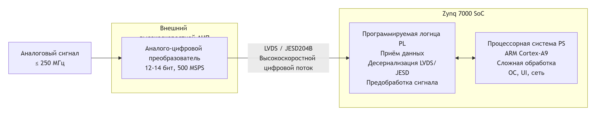

# димломная работа

## На луче схематенихческие ускорения не требуются, того что делает Семен, достачно

1. Сворачивать диплом, менять тему
2. Можно собирать данные, ~80 точек и обрабатывать их софтом верхнего уровня

- Примерная частота импульса 500Кгц
    - Получается по частоте Найквиста, желательная минимальная частота дескритизации равна 1 МГц **(Fs > 2 * Fmax)**
    - При АЦП со значением 40 мегасемплов, будт примерно 80 точек на импульс
    - Для получения дополнительной информации импульса, благодаря высокой частоте диксретизации, можно считать интеграл импульса **суммой площадей элементарных фигур**

- ДЖиПиТи говорит, что по форме импульса ( интеграл ) можно делать некоторые выводы, что в порах породы, так что возможно полезно

- Так же благодаря большому колличеству точек, получается хороший ОСЦИЛЛОГРАФ

- В Целом получив информацию о каждом импульсе с высокой дискретизацией, можно много чего сделать с каждым импульсом

1) Мы можем получива 80 точек построить спектр по амплитудам и спект по площади импульса
    - Спектр по амплитудам дешевый и уже реализован
    - Спектр по площали импульса не реализован, может быть полезен в исследовательской работе, нужен ли он и полезен  ли он, мб нам достаточно спектра по амплитудам

# По сути работа скатилась к тому, что надо попробовать снять 80 точек импульса, дискратезирировать, оцифровать и на ПК получить данные для накопления и построенния дальнейшего спектра по амплитуде и площади и делать какие-то выводы

# Переговоры с Власовым
1. Сравнить карелириются ли собранные данные спектров по ширине импульса и по пику в лабароторных условиях на луче в печи и на холодную
2. Найти статьи по снятию спектров гаммы
3. Составь список вопросов после чтения статей
4. Возможно можно сделать коректирующую зависимость от температуры
5. https://www.sciencedirect.com/science/article/pii/S0168900209003416 - температура
6. https://ieeexplore.ieee.org/stamp/stamp.jsp?tp=&arnumber=5503750&tag=1 - форма импульса

# Принцип работы
**Аналоговый сигнал (с частотой до Fmax)** -> **Внешний АЦП преобразовывает его в цифровой поток** -> **Этот цифровой поток, через высокоскоростной интерфейс (как LVDS или JESD204B), передаётся на ПЛИС.** -> **На данный момент Zynq 7000** 

# Инфа о FPGA
[Файл с выводами](./Arguments_in_favor_of_fpga.md)

# АЦП :
**Финансово упираюсь 250МГц частоты дискретизации ~3500р**
- Наверное целеесобразней разводить плату под два разных корпуса, чтобы можно было отлаживаться от дешевом 100MPS АЦП, а в случае успеха или появлении лишних денег покупать за 7к 250MPS АЦП

[Файл с инфой](./References/ADC/adc_info.md)
# Выводы после прочтения статей
[Форма сигнала](./References/review_gamma_ray_digital_filtering.md)

# Интересная формула
$$F_s = \frac{1000 \, \text{(нс/мкс)}}{t_{\text{rise}} \, \text{(нс)}} \times N_{\text{points}}$$

**Где:**  
- $F_s$ — частота дискретизации (в МГц)  
- $t_{\text{rise}}$ — время нарастания фронта (в наносекундах)  
- $N_{\text{points}}$ — необходимое количество точек на фронт
- При детекторе с ФЭУ, время нарастания фронта = ~500нс , можно утверждать, что это паспортная константа.

$$N_{\text{points}} = \frac{F_s * t_{\text{tise}}}{1000};$$
$${\text{(Формула для расчёта кол-ва точек для нужного АЦП)}}$$

**Для АЦП 100Мгц :**

$$N_{\text{points}} = \frac{100 * {\text{500}}}{1000} = 50$$

**Для АЦП 250МГц :**

$$N_{\text{points}} = \frac{250 * {\text{500}}}{1000} =125$$
