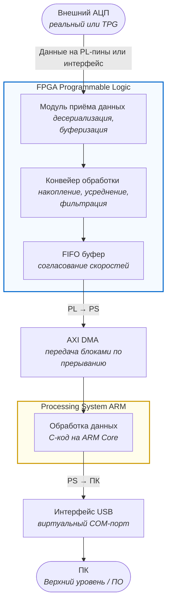

# Архитектура сквозного тракта обработки данных

Ниже представлена структурная схема прохождения и обработки данных от АЦП до персонального компьютера.

### Описание процесса

1. **АЦП (Внешний АЦП)**: Получает данные от аналогового сигнала и конвертирует его в цифровой формат.
2. **PL (FPGA Programmable Logic)**:
   - **RX (Модуль приёма данных)**: Десериализует и буферизует данные.
   - **DSP (Конвейер обработки)**: Накапливает, усредняет и фильтрует данные.
   - **FIFO (FIFO буфер)**: Согласовывает скорости передачи данных между PL и PS.
3. **DMA (AXI DMA)**: Передает данные блоками по прерыванию.
4. **PS (Processing System ARM)**:
   - **CPU (Обработка данных)**: Обрабатывает данные с использованием C-кода на ARM Core.
5. **USB (Интерфейс USB)**: Виртуальный COM-порт для передачи данных к ПК.
6. **PC (ПК)**: Верхний уровень программного обеспечения, обрабатывающий полученные данные.

Эта диаграмма и описание помогут лучше понять структуру и процесс обработки данных в вашей системе.