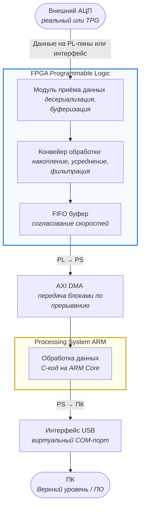

# Архитектура сквозного тракта обработки данных

Ниже представлена структурная схема прохождения и обработки данных от АЦП до персонального компьютера.

# Эта диаграмма и описание помогут лучше понять структуру и процесс обработки данных в вашей системе.

### Описание процесса

1. **АЦП (Внешний АЦП)**: Получает данные от аналогового сигнала и конвертирует его в цифровой формат.
2. **PL (FPGA Programmable Logic)**:
   - **RX (Модуль приёма данных)**: Десериализует и буферизует данные.
   - **DSP (Конвейер обработки)**: Накапливает, усредняет и фильтрует данные.
   - **FIFO (FIFO буфер)**: Согласовывает скорости передачи данных между PL и PS.
3. **DMA (AXI DMA)**: Передает данные блоками по прерыванию.
4. **PS (Processing System ARM)**:
   - **CPU (Обработка данных)**: Обрабатывает данные с использованием C-кода на ARM Core.
5. **USB (Интерфейс USB)**: Виртуальный COM-порт для передачи данных к ПК.
6. **PC (ПК)**: Верхний уровень программного обеспечения, обрабатывающий полученные данные.

# Техническое задание

## На разработку прототипа сквозного тракта цифровой обработки и передачи данных а базе SoC Zynq-7000

# 1. Общие сведения и цель проекта

**Наименование проекта :** Разработка и верификация прототипа системы высокоскротного сбора и прастранственно-параллельной обработки данных для гамма-спектрометрии
**Цель работы:**Создание отладочного прототипа (MVP) на базе СнК (SoC) **Zynq-7000**, реализующего:

1. Прием данных с физического АЦП по интерфейсу SPI.
2. Аппаратную эмуляцию высокоскоростного конвейера обработки данных (эквивалент 800 **MSPS** за счет пространственного параллелизма на частоте **20 МГц**)
3. Высокопроизводительную передачу блоков данных из логической части (PL) в процессорную систему (PS) через **AXI DMA**.
4. Передачу накопленных массивов данных на ПК для последующего анализа формы импульсов, их амплитуды и площади.

# 2. Техническое требование к системе

## 2.1. Требования к аппаратно-программной платформе

- **Базовый кристалл:** Архитектура ARM + FPGA (СнК AMD/Xilinx Zynq-7020).
- **Интерфейс связи с ПК:** USB (Virtual COM-port / UART-to-USB).
- **Интерфейс симуляции потока:** Внешний мост USB-to-SPI для подачи тестовых воздействий с ПК.

## 2.2. Требования к подистеме сбора данных (Реальный режим)

- **Интерфейс:** SPI(FPGA выступает в роли **SPI Master**, самостоятельно генерирует тактовую частоту SCLK для АЦП).
- **Разрядность данных АЦП:** Поддержка двух режимов обработки - 12 бит и 16 бит.
- **Режим работы:** Поцикловое чтение отсчетов с физического АЦП, их выравнивание и передача во входной регистр конвейера обработки.

## 2.3. Требования к конвейеру эмуляции (Высокоскоростной режим 800 MSPS)

- **Концепция верификации:** Моделирование работы АЦП на частоте 800 МГц путем демультиплксирования потока на 40 паралельных каналов ( сэмплов ) в одном такте.
- **Внутренния тактовая частота PL:** **20 МГц** (800 МГц / 40 = 20 МГц)
- **Способ подачи тестов:** Скрипт на Python генерирует коды АЦП (12/16 бит) и транслирует их через USB-SPI мост на физические пины FPGA на частоте 20 МГц, имитируея паралельный срез высокоскоростного потока.

## 2.4. Требования к трассировке и передаче данных (PL -> PS -> ПК)

- **Согласование скоростей:** Использование аппаратных блоков FIFO в PL для сглаживания пульсаций поток данных и предотвращения переполнения (<<узкого горлышка>>)
- **Межсистемный интерфейс:** Использование полноценного IP-ядра **AXI DMA** (Direct Memory Access). Данные должны передаваться из PL в ОЗУ процессорной системы не поодиночке , а **пачками ( блоками )** по прерываниям для минимизации накладных расходов процессора.
- **Процессорная обработка (PS):** С-код, выполняемый на процессорном ядре ARM, осуществляет чтение буферов DMA и осуществляет потоковую отправку сырых массивов данных (кодов АЦП) в USB-порт.

## 2.5. Требования к программному обеспечению верхнего уровня (ПК)

- **Прототип ПО (для отладки):** Скрипт на **Python** для приема сырых данных из последовательного порта, валидации структуры пакетов и первичного сохранения в файлы.
- **Основное ПО (финальное):** Приложение на C# (Avalonia), реализующее :

    1. Высокоскоростной прием потока данных.
    2. Визуализацию формы импульсов (цифровой осциллограф на 80 точек).
    3. Расчёт параметров кажждого импульса: пиковая амплитурда, площадь импульса ( интерграл методом суммирования элементарных фигур).
    4. Построение двух видов гистограмм : спектр по амплитудам , спектр по площади ( интегралам )

# Этап 1.

#### RTL-проектирование подсистем PL (Verilog)Разработка модуля SPI Master с настраиваемой разрядностью (12/16 бит).Проектирование параллельного регистра приема 40 сэмплов (эмуляция 800 MSPS на физической частоте 20 МГц).Создание тестового окружения (Testbench) для симуляции логики в Vivado Simulator.

# Этап 2.

#### Интеграция системы в Vivado IP IntegratorСборка Block Design: добавление процессорного блока Zynq7000, блоков FIFO и ядра AXI DMA.Объединение кастомных RTL-модулей с системной шиной AXI4-Stream.Генерация bitstream-файла и экспорт аппаратной платформы (.xsa).

# Этап 3.

#### Разработка ПО для встроенного процессора (Vitis / C-code)Инициализация драйверов AXI DMA и настройка прерываний по окончании передачи блока (Scatter-Gather или Simple DMA mode).Выделение кольцевого буфера в DDR-памяти для приема пачек данных от PL.Написание конвейера отправки данных через встроенный USB-контроллер Zynq (Virtual COM) на ПК.

# Этап 4.

#### Разработка ПО верхнего уровня и верификацияСоздание Python-скрипта для генерации тестового потока через внешний контроллер USB-SPI.Создание базового интерфейса на C# для визуализации 80-точечного импульса, расчета площадей и построения амплитудно-интегральных спектров.Проведение финальных тестов: проверка стабильности передачи данных «пачками» без потерь отсчетов.
